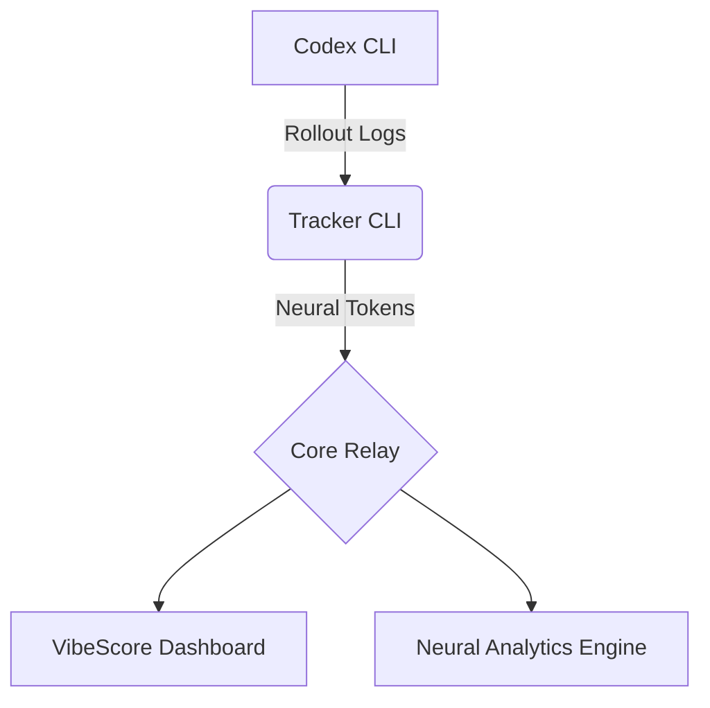

<div align="center">

# 🟢 VIBESCORE

**QUANTIFY YOUR NEURAL OUTPUT**  
_Real-time Neural Analytics for Codex CLI_

[](https://opensource.org/licenses/MIT)
[](https://nodejs.org/)
[](https://www.apple.com/macos/)

[**Documentation**](docs/) • [**Dashboard**](dashboard/) • [**Backend API**](BACKEND_API.md)

</div>

---

## 🌌 Overview

**VibeScore** 是一个专为 macOS 开发者设计的智能令牌（Token）使用追踪系统。它能够实时监控 Codex CLI 的输出，通过高度可视化的 **Matrix** 风格仪表盘，将你的 AI 产出（AI Output）转化为可量化的指标。

> [!TIP] > **Core Index**: 我们的核心指数，通过分析 token 消耗速率与模式，反映你的开发心流状态。

## 🚀 核心功能

- 📡 **Live Sniffer**: 实时监听 Codex CLI 管道，通过底层 Hook 捕获每一次补全事件。
- 📊 **Matrix Dashboard**: 基于 React + Vite 的高性能仪表盘，具备热力图、趋势图与实时日志。
- ⚡ **Neural Analytics**: 深度分析 Input/Output Token，支持缓存（Cached）与推理（Reasoning）部分的分离显示。
- 🔒 **Identity Core**: 完备的身份验证与权限管理，保护你的开发数据。

## 🛠️ 快速开始

### 安装

只需一行命令，即可初始化环境：

```bash
npx --yes @vibescore/tracker init
```

### 同步与查看

```bash
# 同步最新的本地会话数据
npx --yes @vibescore/tracker sync

# 查看当前连接状态
npx --yes @vibescore/tracker status
```

## 🏗️ 架构说明



## 💻 开发者指南

如果你想在本地运行或贡献代码：

### 仪表盘开发

```bash
# 安装依赖
cd dashboard
npm install

# 启动开发服务器
npm run dev
```

### 整体架构验证

```bash
# 验证 Copy 注册表
npm run validate:copy

# 执行烟雾测试
npm run smoke
```

## 📜 开源协议

本项目基于 [MIT](LICENSE) 协议开源。

---

<div align="center">
  <b>System_Ready // 2024 VibeScore OS</b><br/>
  <i>"More Tokens. More Vibe."</i>
</div>
